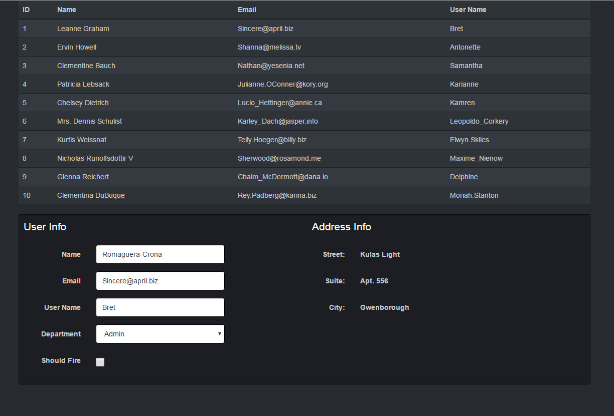

# React/Redux Example of Master Detail

Initial setup created using Stephen Grider's [ReduxSimpleStarter](https://github.com/StephenGrider/ReduxSimpleStarter)

* Uses [Redux Form](http://redux-form.com/5.2.5/#/?_k=r6m77i)

* Gets fake user data from [JSONPlaceholder](http://jsonplaceholder.typicode.com/users)

* Uses [Bootswatch Slate](https://bootswatch.com/slate/) theme

